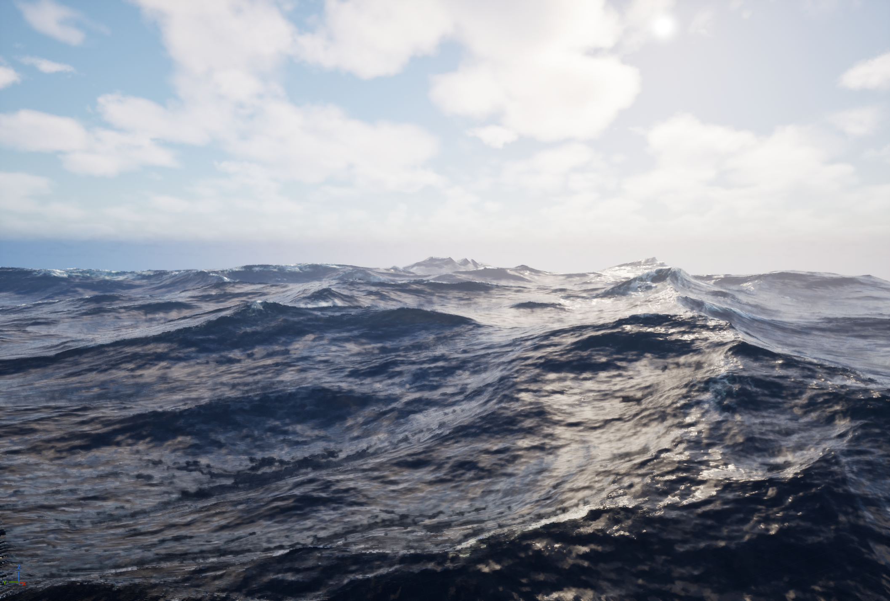

# UE5 FFT Ocean

An Unreal Engine 5.6 ocean rendering demo based on Epic's community tutorial, [Ocean Simulation](https://dev.epicgames.com/community/learning/tutorials/qM1o/unreal-engine-ocean-simulation). The project uses Niagara GPU simulation stages and custom HLSL/USH code to generate FFT-driven ocean displacement data, then feeds the result into a translucent water material for animated waves, foam, roughness variation, and sunlight scattering.

## Current Features

- FFT ocean spectrum generation and inverse FFT passes implemented through Niagara GPU simulation stages.
- Custom shader helper files under `USHFile/` for complex math, FFT butterfly passes, and ocean data export.
- Cascaded render targets for vertex and pixel ocean attributes, including displacement, derivatives, foam, and roughness data.
- Preview water material built from reusable material functions for cascade sampling, foam, scattering, roughness, and color adjustment.
- High-density ocean plane asset with updated bounds for large wave displacement and viewport stability.
- Demo map at `Content/Ocean.umap` with a configured ocean preview scene.

## Project Layout

- `Content/Effects/` - Niagara system and modules for FFT ocean simulation.
- `Content/Materials/` - Water material and material functions.
- `Content/Render_Target/` - Render targets used by the simulation and material.
- `Content/Meshes/` - Ocean plane mesh.
- `Content/Textures/` - Water albedo and normal textures.
- `USHFile/` - Custom HLSL/USH shader snippets used by Niagara custom code.

## Running

1. Open `FFT_Ocean.uproject` with Unreal Engine 5.6.
2. Open the map `Content/Ocean.umap`.
3. Let shaders compile, then run or preview the scene in the editor viewport.

## Notes

This is a learning-oriented graphics prototype rather than a production ocean system. The implementation follows the structure of the referenced tutorial while adding local material tuning, scattering fixes, and mesh bounds adjustments made during iteration.
