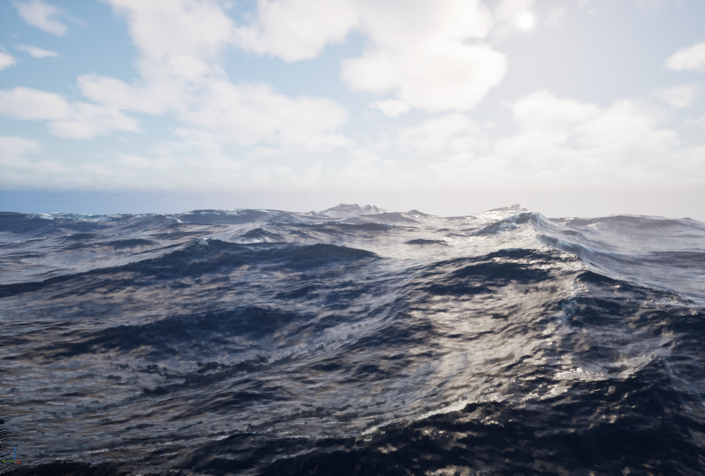

# UE5 FFT Ocean



An Unreal Engine 5.6 ocean rendering demo based on Epic's community tutorial, [Ocean Simulation](https://dev.epicgames.com/community/learning/tutorials/qM1o/unreal-engine-ocean-simulation). The project uses Niagara GPU simulation stages and custom HLSL/USH code to generate FFT-driven ocean displacement data, then feeds the result into a translucent water material for animated waves, foam, roughness variation, and sunlight scattering.

## Current Features

- FFT ocean spectrum generation and inverse FFT passes implemented through Niagara GPU simulation stages.
- Custom shader helper files under `USHFile/` for complex math, FFT butterfly passes, and ocean data export.
- Cascaded render targets for vertex and pixel ocean attributes, including displacement, derivatives, foam, and roughness data.
- Preview water material built from reusable material functions for cascade sampling, foam, scattering, roughness, and color adjustment.
- High-density ocean plane asset with updated bounds for large wave displacement and viewport stability.
- Demo map at `Content/Ocean.umap` with a configured ocean preview scene.

## Simulation and rendering

The tutorial provides the ocean simulation structure. This repository retains that basis and the author's material tuning, scattering fixes and mesh bounds adjustments; these additions are not a claim of an original FFT ocean algorithm.

```text
Spectrum / time evolution (Niagara GPU stages)
    -> Row and column IFFT passes (OceanWaterFFT.ush)
    -> Vertex and pixel attribute render targets
    -> Cascade sampling in water material functions
    -> Displacement, foam, roughness and sunlight scattering
```

The readable FFT helper uses `LENGTH = 256` and `BUTTERFLY_COUNT = 8`. Pixel attribute targets are stored for cascades `Casc0` through `Casc3`; the Niagara graphs and material wiring are serialized Unreal assets rather than standalone executable shader source.

## Project Layout

- `Content/Effects/` - Niagara system and modules for FFT ocean simulation.
- `Content/Materials/` - Water material and material functions.
- `Content/Render_Target/` - Render targets used by the simulation and material.
- `Content/Meshes/` - Ocean plane mesh.
- `Content/Textures/` - Water albedo and normal textures.
- `USHFile/` - Custom HLSL/USH shader snippets used by Niagara custom code.

## Running

Prerequisite: Unreal Engine **5.6**, matching `EngineAssociation` in the project descriptor. This is a content/Blueprint project without a native C++ module.

```sh
git clone https://github.com/JiaT-T/UE5-FFT-Ocean.git
cd UE5-FFT-Ocean
```

1. Open `FFT_Ocean.uproject` in UE 5.6 and keep Niagara available for the simulation assets.
2. Open `/Game/Ocean` (`Content/Ocean.umap`); it is also the configured startup/default map.
3. Let shaders compile, then preview the scene or use Play in Editor.
4. Inspect `FX_Ocean_Water` under `Content/Effects/` and the material functions under `Content/Materials/` to follow the simulation-to-render-target connection. `USHFile/` contains supporting shader snippets, not a separate build target.

`Binaries/`, `DerivedDataCache/`, `Intermediate/` and `Saved/` are ignored and regenerated locally. A complete checkout is required: the material, Niagara, map and texture assets are part of the demo.

## Notes

This is a learning-oriented graphics prototype rather than a production ocean system. The implementation follows the structure of the referenced tutorial while adding local material tuning, scattering fixes, and mesh bounds adjustments made during iteration.

The September 2026 repository review checked the UE version, configured map, asset paths and readable USH helpers. UE 5.6 was unavailable in that review environment, so opening the binary graphs, shader compilation and visual behavior were not verified there. The preview records an existing result, not a new regression run.

## References and asset provenance

- [Epic community tutorial: Ocean Simulation](https://dev.epicgames.com/community/learning/tutorials/qM1o/unreal-engine-ocean-simulation) — tutorial foundation for the Niagara ocean workflow.
- `USHFile/OceanWaterFFT.ush` identifies modified FFT image-processing code and retains its **Intel 2014 permission notice**. Keep that notice with copies or derivatives of the file.
- The repository includes water textures and a plane FBX; their separate redistribution terms are not documented in the current tree. Tutorial attribution does not establish a license for every asset. No blanket license is added by this cleanup.
